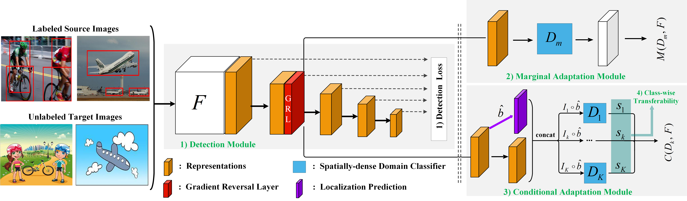
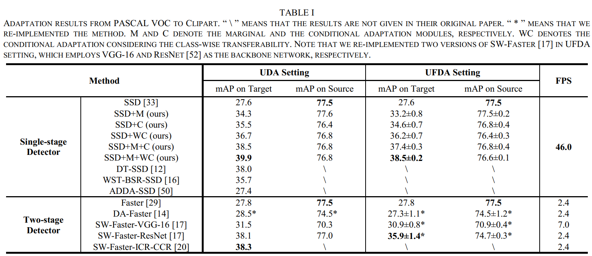
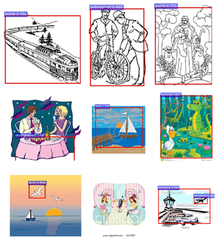
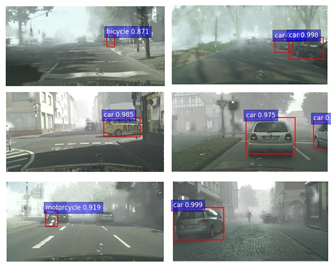
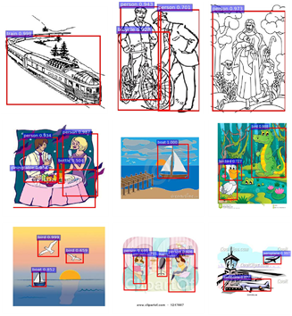
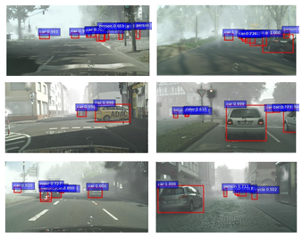

<div align="center">
  <h1>Joint Distribution Alignment via Adversarial Learning for Domain Adaptive Object Detection<br></h1>
</div>

<!-- <div align="center">
  <h3><a href=></a>, <a href=></a>, <a href=></a>, <a href=></a></h3>
</div> -->

<div align="center">
  <h4> <a href=https://ieeexplore.ieee.org/document/9546634>[paper] IEEE Link</a></h4>
</div>

<div align="center">
  <h4> <a href=https://arxiv.org/abs/2109.09033>[paper] ArXiv Link</a></h4>
</div>

<div align="center">
  
</div>


 <br><br/>
 
If you find our code or paper useful to your research work, please consider citing our work using the following bibtex:
```
@article{zhang2021joint,
  title={Joint distribution alignment via adversarial learning for domain adaptive object detection},
  author={Zhang, Bo and Chen, Tao and Wang, Bin and Li, Ruoyao},
  journal={IEEE Transactions on Multimedia},
  year={2021},
  publisher={IEEE},
  doi={10.1109/TMM.2021.3114550}
}
```

## Code Environment
1. Our experimental settings: (a) CUDA version >= 9.0; (b) NVIDIA Titan XP or GeForce RTX 2080ti; (c) Ubuntu 16.04.6 LTS

2. Dependency libraries of caffe platform are needed (http://caffe.berkeleyvision.org/installation.html):
```
sudo apt-get install libprotobuf-dev libleveldb-dev libsnappy-dev libopencv-dev
sudo apt-get install libhdf5-serial-dev protobuf-compiler
sudo apt-get install --no-install-recommends libboost-all-dev
sudo apt-get install libatlas-base-dev
sudo apt-get install python-dev
sudo apt-get install libgflags-dev libgoogle-glog-dev liblmdb-dev
```

3. Build the Caffe libraries:
```
make -j32
make pycaffe -j32
```
Note: Our Makefile.config file is recommended for building the caffe


## Preparation Step
### Download the dataset
You can download the LMDB format of the PASCAL VOC and Clipart datasets \[[Dataset Page](https://drive.google.com/file/d/1L2M5MufYNn6mQbOvD0RzFoXHd5WyWyq3/view?usp=sharing)\], or preprocess the your own datasets according to the following steps:

1. Construct a dataset folder in JADF-caffe/data/VOCdevkit with the following form: 
```
VOC2007
---ImageSets
---Main
   ---trainval.txt
   ---test.txt
---JPEGImages
---Annotations
```

2. Create LMDB format file

Generate the LIST FILE of your dataset, such as test_name_size.txt and trainval_name_size.txt:
```
cd JADF-caffe/data/VOC0712/
sh create_list.sh
```

3. Generate the LMDB file:
```
sh create_data.sh
```

### Download the pretrained model
1. For pre-training a source model, you can use the ImageNet-pretrained-model: https://drive.google.com/open?id=1b26AyOux2bOpHlOo5Jv9E7_RX5ik-icE

2. You can perform the adversarial adaptation by using the pre-trained source model (on PASCAL VOC0712 trainval.txt)：https://drive.google.com/open?id=12GzAJ7htn_D1-R6R-NfJ3qNLur38PF8k


## Train and Evaluate Our Method

1. cd JADF-caffe
2. Download the LMDB format of the clipart dataset: voc_clipart.zip
3. Copy the voc_clipart.zip to JADF-caffe/data/VOCdevkit/ and extract it:
   unzip voc_clipart.zip
   
4. Download the pretrained-model.
5. Copy VGG_ILSVRC_16_layers_fc_reduced.caffemodel(or VGG_VOC0712_SSD_300x300_iter_120000.caffemodel) to JADF-caffe/model/VGGNet/
6. cd JADF-caffe
7. make -j32 && make pycaffe -j32（If you are having issues compiling, and please refer to requirement.txt for installing several dependencies of caffe）
8. For pre-training the source model：
   ```
   sh job/VGGNet/VOC0712_Clipart/DA_SSD_300/train_source.sh
   ```
   For performing the Unsupervised Domain Adaptation (UDA) from the source model：
   ```
   sh job/VGGNet/VOC0712_Clipart/DA_SSD_300/voc_clip_da.sh
   ```
   For performing the Unsupervised Few-shot Domain Adaptation (UFDA, 3-shot) from the source model：
   ```	 
   sh job/VGGNet/VOC0712_Clipart/DA_SSD_300/voc_clip_fsda.sh
   ```
   
## Selected cross-domain objec detection results
Here we report some mAP comparisons under UDA and UFDA settings for cross-domain adaptation from PASCAL VOC to Clipart:


<div align="center">
  
</div>

Visual detection results of SSD model:






Visual detection results of our JADF model:






## Contact
We have tried our best to verify the correctness of our released data, code and trained model weights. 
However, there are a large number of experiment settings, all of which have been extracted and reorganized from our original codebase. 
There may be some undetected bugs or errors in the current release. 
If you encounter any issues or have questions about using this code, please feel free to contact us via bo.zhangzx@gmail.com

